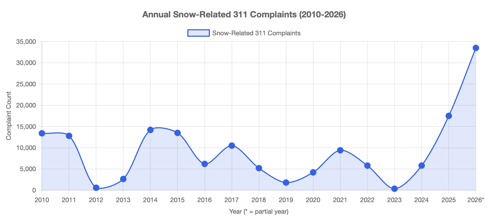

# NYC Snow Analysis 2010-2026 with Claude Cowork



What do you get when you unleash [Claude Cowork](https://claude.com/product/cowork) on:

* [All of NYC's 311 Service Requests](https://opendata.cityofnewyork.us/311-service-requests-from-2010-to-present-updates/) covering 2010 to 2026-02-22 - **all 24.1gb with 42,873,338 rows!!!**
* NYC's [DCP Housing Database (Inactives Included) from 2010-2025](https://www.nyc.gov/content/planning/pages/resources/datasets/housing-project-level) with 106,358 rows and its Data Dictionary

And install in Cowork:

* our [qsv MCP Server](https://github.com/dathere/qsv)
* the [US Census MCP Server](https://github.com/uscensusbureau/us-census-bureau-data-api-mcp)
* the [Open-Meteo Weather MCP Server](https://github.com/cmer81/open-meteo-mcp)

## The Prompt

```text
Can you analyze the NYC 311 file as well as the Housing Database (consult the
Data Dictionary PDF) and retrieve from the web all the snowstorms in NYC
since 2010, the current weather details during the snowstorm, NYC news
coverage about the City's handling for each snow event, further enriching it
with Census Data and glean from your detailed temporal analysis any
interesting insights that can be shared with the current administration?
```

## The Results

34 minutes later, we get a comprehensive analysis of NYC's snow response over the last 16 years, complete with data visualizations, insights, and recommendations for future improvements:

* [NYC_Snow_Response_Analysis.html](./reports/NYC_Snow_Response_Analysis.html)
* [NYC_Snow_Response_Analysis.docx](./reports/NYC_Snow_Response_Analysis.docx) ([pdf](./reports/NYC_Snow_Response_Analysis-docx.pdf))
* [NYC_Snow_Response_Briefing.pptx](./reports/NYC_Snow_Response_Briefing.pptx) ([pdf](./reports/NYC_Snow_Response_Briefing-slides.pdf))

The Cowork session transcript to produce these reports is available [here](./claude_cowork_generated/nyc_snow_analysis-cowork_transcript.html).

## Follow-up Question

```text
Can you also do an extended temporal analysis on related snow-related
complaint types (e.g. heating, shelter, frozen pipes, etc.) over the same period
using both datasets, leveraging historical weather data and the Census?
```

24 minutes later, we get these additional insights and visualizations:

* [NYC_Snow_Adjacent_Analysis.html](./reports/NYC_Snow_Adjacent_Analysis.html)
* [NYC_Snow_Adjacent_Analysis.docx](./reports/NYC_Snow_Adjacent_Analysis.docx) ([pdf](./reports/NYC_Snow_Adjacent_Analysis-docx.pdf))
* [NYC_Snow_Adjacent_Briefing.pptx](./reports/NYC_Snow_Adjacent_Briefing.pptx) ([pdf](./reports/NYC_Snow_Adjacent_Briefing-slides.pdf))

The Cowork session transcript for the follow-up question is available [here](./claude_cowork_generated/nyc_snow_adjacent_analysis_transcript.html).

## Conclusion

This experiment demonstrates the power of Claude Cowork to handle large datasets, integrate multiple data sources, and produce comprehensive analyses and deliverables in a fraction of the time it would take a human analyst. With the right prompt, [purpose-built tooling for **_"StatsSighting"_** (data-wrangling accelerated by blazing-fast, desktop-based, statistical profiling)](https://github.com/dathere/qsv/issues/3482), and access to [relevant](https://open-meteo.com/) [data](https://www.census.gov/data/developers/guidance/api-user-guide.html), Cowork can generate insights that can inform policy decisions and improve public services.

BUT, how can we be sure the insights are valid? How can we verify the accuracy of the analysis and the quality of the deliverables? This is where human judgment and expertise still play a crucial role. Cowork can do the heavy lifting of data processing and initial analysis, but _**humans** still need to review, validate, and interpret the results to ensure they are actionable and meaningful_.

That's why we call it **_"Accelerated Civic Intelligence (ACI)"_** - it's not about replacing human analysts, but about augmenting their capabilities and accelerating the process of generating insights that can drive positive change in our cities.

IMHO, if ["computers are the bicycle for our minds"](https://www.themarginalian.org/2011/12/21/steve-jobs-bicycle-for-the-mind-1990/), then AI tools like Claude Cowork are more like an Iron Man suit: they dramatically extend our reach, strength, and speed. But even the most advanced suit still needs a capable pilot. The technology can amplify our abilities — it’s human judgment, experience, and civic responsibility that determine where we go and why.

> ℹ️ **NOTE:**  
> If you're seeing 404 errors on the links above, this README is designed to be viewed on GitHub Pages, where Markdown files are rendered as HTML with proper formatting and working links. View the full report here: [https://dathere.github.io/NYC-Snow-Analysis-2010-2026-Claude-Cowork/](https://dathere.github.io/NYC-Snow-Analysis-2010-2026-Claude-Cowork/)

---

Github Repo: [https://github.com/dathere/NYC-Snow-Analysis-2010-2026-Claude-Cowork](https://github.com/dathere/NYC-Snow-Analysis-2010-2026-Claude-Cowork)<br>
Github Pages: [https://dathere.github.io/NYC-Snow-Analysis-2010-2026-Claude-Cowork/](https://dathere.github.io/NYC-Snow-Analysis-2010-2026-Claude-Cowork/)<br>
LinkedIn Post: [https://www.linkedin.com/posts/joelnatividad_nyc-snow-analysis-2010-2026-with-claude-cowork-activity-7431791185297567744-RQVm/](https://www.linkedin.com/posts/joelnatividad_nyc-snow-analysis-2010-2026-with-claude-cowork-activity-7431791185297567744-RQVm/)

<script src="https://giscus.app/client.js"
        data-repo="dathere/NYC-Snow-Analysis-2010-2026-Claude-Cowork"
        data-repo-id="R_kgDORXES2Q"
        data-category="Announcements"
        data-category-id="DIC_kwDORXES2c4C3HLN"
        data-mapping="pathname"
        data-strict="0"
        data-reactions-enabled="1"
        data-emit-metadata="0"
        data-input-position="bottom"
        data-theme="light_protanopia"
        data-lang="en"
        data-loading="lazy"
        crossorigin="anonymous"
        async>
</script>
